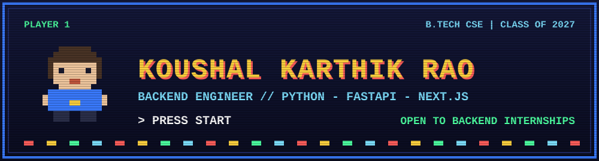

<p align="center">
  
</p>

<p align="center">
  <a href="https://koushalkarthik5-portfolio.vercel.app">Portfolio</a> &middot;
  <a href="https://linkedin.com/in/koushalkarthikrao">LinkedIn</a> &middot;
  <a href="https://leetcode.com/u/blacktongue343/">LeetCode</a> &middot;
  <a href="mailto:koushalkarthik5@gmail.com">Email</a>
</p>

---

## > PLAYER 1

```text
+-----------------------------------------------------------+
| NAME     : Koushal Karthik Rao                            |
| CLASS    : Backend Engineer (Python / FastAPI)            |
| SCHOOL   : AVN Institute of Engineering & Technology      |
| BASE     : Hyderabad, India                               |
| STATUS   : Open to backend internships                    |
+-----------------------------------------------------------+
```

Computer science undergraduate who builds end-to-end backend systems: API design, databases, ML integration, automated tests and CI, and deployment. Below are the missions I've completed and what I'm working on next.

---

## > MISSION SELECT

| Stage | Mission | Objective | Loot | Weapons |
|:--:|---|---|---|---|
| 1 | **[QRShield++](https://github.com/koushalkarthik15/QR-Code-security)** ([play](https://qr-code-security-6caq.vercel.app)) | Scan a QR code and get an ML risk score before opening the link | 1M benign + 4.3K phishing URLs audited, 31 tests, live demo | Next.js, FastAPI, PostgreSQL, scikit-learn, Docker |
| 2 | **[CrisisPilot](https://github.com/koushalkarthik15/CrisisPilot-Slack)** | Slack-native crisis management with AI-assisted recommendations | 12-table async schema, 50+ Slack handlers, 27 tests | Python, FastAPI, Slack Bolt, SQLAlchemy, LangGraph |
| 3 | **[Mini-SOC](https://github.com/koushalkarthik15/SecurityOperationCenter)** | Live threat-monitoring dashboard with ML classification | 81.2% accuracy on 9,537 records, 7 endpoints, 26 tests, team of 4 (lead) | Python, scikit-learn, SQLite, TypeScript, React |
| Bonus | **[EcoSphere](https://github.com/koushalkarthik15/EcoSphere)** ([play](https://eco-sphere-wine.vercel.app)) | Climate-tech dashboard combining satellite and emissions data | Hackathon build | FastAPI, Next.js |

**Boss fights so far:** a 1,000,000 : 4,300 class imbalance, and fitting scikit-learn inside a 250 MB serverless limit.

---

## > INVENTORY

| Slot | Items |
|---|---|
| Languages | Python &middot; Java &middot; JavaScript &middot; TypeScript &middot; SQL |
| Backend | FastAPI &middot; SQLAlchemy / SQLModel &middot; REST API design &middot; async Python |
| Frontend | React &middot; Next.js |
| Data & ML | PostgreSQL &middot; SQLite &middot; scikit-learn &middot; LangGraph &middot; LLM APIs (OpenAI, Groq) |
| Testing & DevOps | pytest &middot; Jest / Vitest &middot; Playwright &middot; Docker &middot; GitHub Actions &middot; Git &middot; Linux |

---

## > ACHIEVEMENTS UNLOCKED

- **Regional Finalist (Top 10 Teams)**, AMD Ryzen Slingshot National Hackathon. Led a multidisciplinary team.
- **First Place**, Mind Marathon (quiz), Dept. of AI & Data Science, AVN Institute. Led the winning team.

---

## > QUEST LOG (in progress)

- [ ] Redis caching and rate limiting on QRShield++, with before/after benchmarks
- [ ] Deploy a backend to the cloud (AWS / GCP)
- [ ] NeetCode 150 and weekly LeetCode contests
- [ ] First merged open-source pull request
- [ ] A RAG project with a measured evaluation set

<details>
<summary>Enter cheat code: up up down down left right left right B A</summary>

<br>

**How I work**
- Test the risky parts, and run the tests in CI before every deploy
- Document trade-offs and limits, not just features
- Report numbers (dataset size, accuracy, test counts) instead of adjectives
- Keep changes small and reviewable

</details>

---

## > SAVE POINT

Insert coin to start a conversation: **[koushalkarthik5@gmail.com](mailto:koushalkarthik5@gmail.com)** or find me on [LinkedIn](https://linkedin.com/in/koushalkarthikrao).